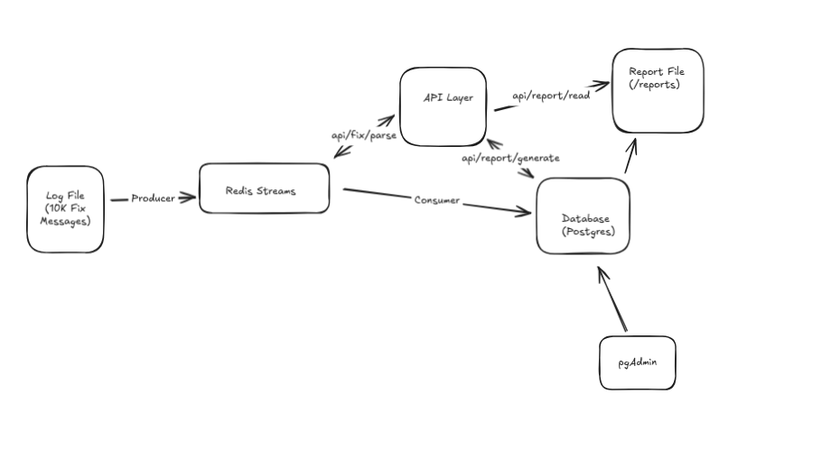

# 📈 FIX Message Processing Pipeline

A complete end-to-end system for ingesting, parsing, streaming, storing, and reporting on **FIX (Financial Information eXchange)** protocol messages.

This project demonstrates a modern distributed event-driven architecture using:

- **Spring Boot API Layer**
- **Redis Streams** (Producer + Consumer)
- **PostgreSQL Database**
- **Docker Compose Orchestration**
- **Modular Maven Build**
- **Automated FIX Report Generation**
- **pgAdmin Database UI**

The system reads a FIX log file from `/logs`, processes it through Redis Streams, stores parsed messages in PostgreSQL, and exposes APIs to generate and read reports stored in `/reports`.

---

## 🖼 Architecture Overview



---

##  Features

### FIX Log → Redis Stream Ingestion
A producer service streams FIX messages from a log file (10k+ messages) into Redis Streams.

### Real-Time FIX Consumer
A consumer parses FIX messages and stores structured rows into PostgreSQL.

### REST API Layer (Spring Boot)
Endpoints include:

- `api/fix/parse` — trigger log → Redis processing
- `api/report/generate` — create summarized FIX reports
- `api/report/read` — access generated reports

### Automated Report Generation
Reports are generated and stored under:

### Database Management via pgAdmin
Easily inspect tables, messages, and reports with a browser GUI.

---

# Running the Entire Stack

Run from the same directory as `docker-compose.yml`:

```bash
chmod +x start.sh
./start.sh

#pgAdmin Access

URL
http://localhost:5050

Credentials:
- Username:admin@local.com
- Password:admin
```

If the database password is requested, use: postgres


